<picture>
  <source media="(prefers-reduced-motion: reduce) and (prefers-color-scheme: dark)" srcset="dist/scene-still.svg">
  <source media="(prefers-reduced-motion: reduce)" srcset="dist/scene-light-still.svg">
  <source media="(prefers-color-scheme: dark)" srcset="dist/scene.svg">
  <source media="(prefers-color-scheme: light)" srcset="dist/scene-light.svg">
  
</picture>

# pizza-cat

**Your GitHub profile deserves a main character. Possibly two. Definitely snacks.**

A small, forkable engine for animated GitHub profile scenes. Draw a character with text-based pixel grids, give it a palette and a little choreography, then generate an SVG you can commit and embed in your README.

The demo stars **Crumb**, a dog with excellent intentions, and **Miso**, a cat with undisclosed intentions. The pizza has its own schedule.

TypeScript generates the scene. SVG/SMIL plays it. Once committed, it needs no server, external service, or JavaScript in your profile.

[Quick start](#two-minute-quick-start) · [Make a character](#create-your-character) · [Embed it](#add-it-to-your-profile-readme) · [Animation guide](docs/animation.md)

## Two-minute quick start

You need **Node.js 22+** and npm. The repository has no production dependencies.

1. [Fork this repository](https://github.com/suchipizza/pizza-cat/fork), or use **Use this template** for a fresh history.
2. Clone your copy and run:

   ```sh
   git clone https://github.com/YOUR-USERNAME/pizza-cat.git
   cd pizza-cat
   npm install
   npm run preview
   ```

3. Open **http://127.0.0.1:3000**. Edit `profile.config.ts` and save. The preview regenerates automatically.
4. Run `npm run check`, commit your changes (including `dist/`), and push. Copy the [embed below](#add-it-to-your-profile-readme) into your profile README.

Already happy with the cast? Change their names and colors. Want a new species entirely? The renderer has no opinion on the matter.

## Fork this repo

Forking keeps upstream history, which is useful for pulling in future engine improvements. A template copy gives you an independent repository. Both workflows work with the same config and generated SVGs.

The **Generate profile scene** Action runs on the default branch when config, assets, or generator code changes. You can also run it from **Actions → Generate profile scene → Run workflow**. It commits updated `dist/` files only when they change. Generated commits do not trigger another generation run.

On a fork, enable Actions if GitHub prompts you. The workflow requests `contents: write` for its generation job and uses the built-in `GITHUB_TOKEN`; no personal token is needed. If repository rules prevent bot commits to the default branch, generate locally and include `dist/` in your normal commit or PR.

Keep the scene repository **public** if a public profile needs to load its raw SVGs. GitHub images cannot authenticate to a private fork on behalf of visitors.

## Create your character

### Keep the sprite, change the personality

Each scene instance has its own appearance, scale, name, and animation:

```ts
{
  id: 'my-cat',
  preset: 'demo-cat',
  name: 'Director of Unscheduled Naps',
  position: { x: 680, y: 244 },
  scale: 3.5,
  appearance: {
    primary: '#28283e',
    secondary: '#49445f',
    eyes: '#cce88b',
    accent: '#dc95a8',
  },
  animation: 'idle',
}
```

`position` is the sprite's **bottom-center anchor**, in canvas pixels. `scale: 3.5` magnifies each authored pixel by 3.5. Appearance roles map to the chosen character's palette. A second instance of the same preset can have different colors and timing.

### Draw someone new

```sh
cp -R characters/_template characters/my-pet
```

Edit the name, palette, and frames; import the character in `characters/index.ts`; add it to `profile.config.ts`; run the preview. The starter's [step-by-step guide](characters/_template/README.md) walks through every edit, including registration. No renderer changes required.

## Customize the scene

`profile.config.ts` owns the cast, theme, canvas, and timeline:

```ts
import { defineProfile } from './src/config.ts';

export default defineProfile({
  // A minimal scene. Use the checked-in config for the full demo choreography.
  title: 'the snack committee',
  description: 'A dog and cat keeping a very relaxed watch over the terrace.',
  canvas: { width: 900, height: 320, groundY: 244 },
  scene: { duration: 18, loop: true, label: 'OPEN TO COLLABORATION. AND TREATS.' },
  theme: {
    dark: {
      background: '#151823', foreground: '#fff1da', muted: '#a8a2b8',
      ground: '#373345', accent: '#f4b76c', panel: '#232331',
    },
    light: {
      background: '#fff9ed', foreground: '#332c40', muted: '#766c80',
      ground: '#dcd0cb', accent: '#925324', panel: '#eee3d7',
    },
  },
  characters: [
    { id: 'one', preset: 'demo-dog', position: { x: 155, y: 244 }, scale: 4, animation: 'walk' },
    { id: 'two', preset: 'demo-cat', position: { x: 680, y: 244 }, scale: 3.5, animation: 'idle' },
  ],
  props: [
    { id: 'snack', preset: 'pizza', position: { x: 780, y: 135 }, scale: 3, animation: 'fly' },
  ],
});
```

Named animations play once per scene cycle and hold their final value. For repeated walking, synchronized reactions, fades, and round trips, use the composable primitives in the [animation guide](docs/animation.md). The checked-in demo is a complete example of a seamless 18-second timeline.

There is no fixed list of species, personality fields, or required animation states. Your next character could be a frog, a robot, or a suspiciously ambitious toaster.

## Preview

```sh
npm run preview
```

The local rehearsal room shows dark and light palettes, canvas dimensions, a scrubber, pause/play, and restart. It watches the config, characters, props, and engine. Configuration errors appear in the page and terminal; fix the error and save again.

The preview starts paused if your system requests reduced motion. To use a different port:

```sh
PORT=3001 npm run preview
```

Generate without starting the preview:

```sh
npm run generate
```

This writes four self-contained files. Do not edit them by hand.

| File | Purpose |
| --- | --- |
| `dist/scene.svg` | Animated, dark palette |
| `dist/scene-light.svg` | Animated, light palette |
| `dist/scene-still.svg` | Still, dark palette |
| `dist/scene-light-still.svg` | Still, light palette |

## Add it to your profile README

A GitHub profile README lives in a public repository with the same name as your username. Commit the generated files to your pizza-cat fork, then paste this into your profile's `README.md`. Replace **every** `YOUR-USERNAME`, plus `pizza-cat` or `main` if you renamed the repository or default branch.

```html
<picture>
  <source
    media="(prefers-reduced-motion: reduce) and (prefers-color-scheme: dark)"
    srcset="https://raw.githubusercontent.com/YOUR-USERNAME/pizza-cat/main/dist/scene-still.svg"
  >
  <source
    media="(prefers-reduced-motion: reduce)"
    srcset="https://raw.githubusercontent.com/YOUR-USERNAME/pizza-cat/main/dist/scene-light-still.svg"
  >
  <source
    media="(prefers-color-scheme: dark)"
    srcset="https://raw.githubusercontent.com/YOUR-USERNAME/pizza-cat/main/dist/scene.svg"
  >
  <source
    media="(prefers-color-scheme: light)"
    srcset="https://raw.githubusercontent.com/YOUR-USERNAME/pizza-cat/main/dist/scene-light.svg"
  >
  
</picture>
```

Adapt the alt text to your scene. The SVG's `viewBox` preserves its aspect ratio; GitHub constrains the image to the available README width. No hosting setup is required.

**Reduced motion:** the optional `<source>` entries above request still images. We cannot guarantee every GitHub client preserves or evaluates those media queries, and an animated SVG image cannot offer its own pause button. For a dependable still experience, embed `scene-still.svg` or `scene-light-still.svg` directly. The still files contain no animation elements.

**An older scene still showing?** GitHub's image proxy may cache the URL. First check the raw file and the generation Action. If needed, change a query-string version on the embed URLs, such as `?v=2`. A commit SHA in place of `main` pins a specific revision.

## Character format

```ts
interface CharacterDefinition {
  id: string;
  name: string;
  dimensions: { width: number; height: number };
  palette: Record<string, string>;
  appearance?: Record<string, string>;
  sprites: Record<string, readonly string[]>;
  animations: Record<string, Animation>;
  defaultFrame: string;
}
```

A sprite is a rectangular text grid:

```ts
const sprite = [
  '..OOOO..',
  '.OPPPPO.',
  'OPEPPEPO',
  '.OPPPPO.',
  '..OOOO..',
];

const palette = {
  O: '#51405e', // outline
  P: '#c3b1e1', // primary
  E: '#26384a', // eyes
};
```

Dots are transparent. Each other ASCII symbol resolves to a hex color. All frames match the declared dimensions. Adjacent same-color cells become larger SVG rectangles, and repeated frames use local sprite definitions to keep output small.

An appearance mapping such as `{ primary: 'P', eyes: 'E' }` lets scene authors customize colors by name. For finer control, an instance can override individual symbols with `palette: { O: '#51405e' }`.

One frame and an empty animation map are enough for a static character. Add `blink`, `walk-1`, `walk-2`, `look-up`, or entirely different states when your scene needs them. Validation catches missing frames, symbols, duplicate instance IDs, and invalid timing before generation.

## Props

Props are independent actors with the same palette, frame, and animation capabilities as characters. They can move, rotate, scale, fade, and switch frames simultaneously.

Included in the pantry:

- **Pizza:** a triangular slice with crust, cheese, and pepperoni. Flies along a curved path and spins.
- **Sushi:** both maki and nigiri frames. Your flight plan decides when to switch.
- **Coffee:** usually stays on the ground. Probably for the best.

Create a definition in `props/`, register it in `props/index.ts`, and add an instance to the config. Motion paths use canvas pixels relative to the instance's position. The renderer does not distinguish food from laptops, stars, or tiny planets.

## Examples

- [Default scene](profile.config.ts): two characters, walking, blinking, looking up, independent flying pizza and sushi, and a seamless return home.
- [Husky + cat + food](examples/husky-cat-food): an original black-and-white husky, the black cat, and five independent pizza, maki, and nigiri flights.
- [Noémie’s profile scene](examples/noemie-profile): the husky/cat cast with a personal header and a live profile built from this template.
- [Character starter](characters/_template): a small original creature with a working blink and full customization instructions.

Generate a separate example without overwriting the demo:

```sh
npm run generate -- --config examples/husky-cat-food/profile.config.ts --out /tmp/pizza-cat-example
```

## Contributing

Small, focused contributions are welcome: original characters, useful props, clearer authoring tools, accessibility improvements, and engine fixes. Include a preview or screenshot for artwork changes and explain any new configuration behavior.

```sh
npm ci
npm run check
```

This checks strict TypeScript, runs engine tests, and regenerates all outputs. Commit `dist/` when your change affects the scene. CI checks Node 22 and 24; PRs also verify that generated files are current.

The tests cover validation, palettes, timing composition, multiple actors, SMIL output, XML validity and escaping, partial definitions, and all four output variants. Artistic coordinates are yours to judge in the preview.

See [architecture](docs/architecture.md) for engine boundaries and v1 limits. Future activity integrations should produce generic scene events/configurations before rendering; the renderer stays deterministic and network-free.

## Credits & license

Inspired by the general idea of animated GitHub profile characters, including [YourTomo](https://github.com/prsdx/YourTomo). This project's artwork, scene, timings, and implementation are original; no YourTomo source or assets are used.

[MIT](LICENSE) — code and included artwork. Make something that feels like you.

The food is not covered by a service-level agreement.
